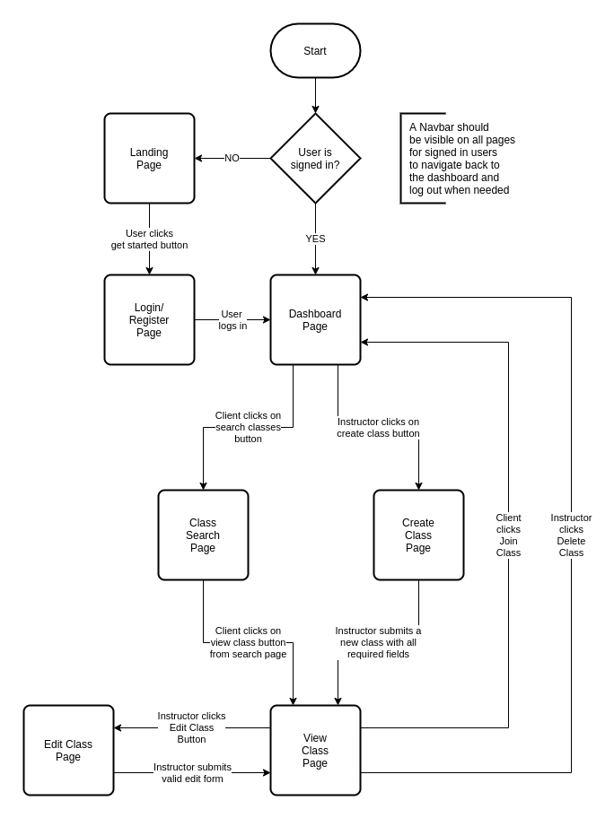

# Anywhere Fitness (Front End)

## DISCLAIMER!

This repository contains source code for the frontend of a fitness platform. This software is provided as-is, with no support, and may or may not be in a working state. It was made for educational purposes, and is not currently intended for production use. You have been warned!

--------------------------------------------------------------------------------

## App-Flow Diagram

The following chart describes initial planning for the overall user experience, and is subject to change as development progresses.

--------------------------------------------------------------------------------

### ☝️ **Pitch**

These days, fitness classes can be held anywhere- a park, an unfinished basement or a garage- not just at a traditional gym. Certified fitness instructors need an easy way to take the awkwardness out of attendance taking and client payment processing.

While you could use several mobile apps to accomplish this, **AnywhereFitness** is the all-in-one solution to meet your "on-location" fitness class needs. AnywhereFitness makes it painless for Instructors and Clients alike to hold and attend Fitness classes wherever they might be held.

Instructors can take attendance, request and process payments, create virtual "punch passes" for each type of class offered, alert clients of cancellations or location changes and so much more. Clients can easily find out information on classes - location, class size, start time and duration, as well as reschedule or cancel an upcoming appointment or reservation right from the mobile app.

### ✅ **MVP**

1. User can create/register as a `client` and login with the registered credentials.

2. User can create/register as an `instructor` by entering an additional Auth Code during signup, and can login with the registered credentials.

3. `client` and `instructor` are both presented with the appropriate on-boarding walkthrough on first sign-in, with an option to skip it.

4. Authenticated `Instructor` can create update and delete a `class`. At a minimum, each `class` must have the following properties:

  - `Name`
  - `Type`
  - `Start time`
  - `Duration`
  - `Intensity level`
  - `Location`
  - `Current number of registered attendees`
  - `Max class size`

5. Authenticated `client` can search for available classes. At a minimum, they must be able to search by the following criteria:

  - `class time`
  - `class date`
  - `class duration`
  - `class type`
  - `intensity level`
  - `class location`

6. Authenticated `instructor` can create virtual punch pass categories for each type of group fitness class they offer (yoga, insanity, RIPPED, pilates, etc.)

7. Authenticated `user` can reserve a spot in a `class` with available seats open, and can reschedule or cancel their current `reservation` from the mobile app.

### 🏃‍♀️**Stretch**

1. Implement payments using PayPal, Stripe or another 3rd party API.
